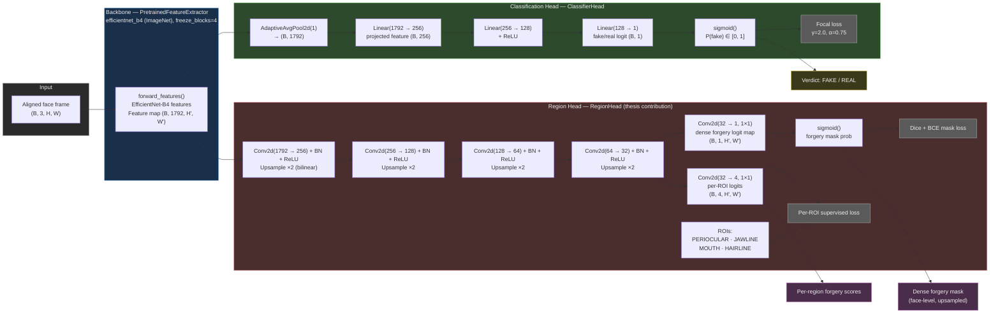
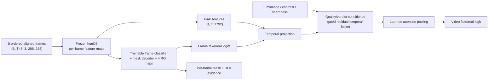

# ROI-Net v2 — Model & Head Architecture

The repository contains two model paths. The deployed `train.py --verdict honi05`
path uses the frozen `honi05` EfficientNet-B4 verdict backbone with trainable heads.
The `train.py` path without `--verdict` uses the configured ImageNet EfficientNet-B4
backbone with its configured frozen blocks. The diagram below describes that generic
`Agent` path; it must not be read as a description of the deployed checkpoint. Both
paths feed **two heads** — the binary classification head and the region (forgery-mask)
head. The four ROIs are fixed landmark-defined boxes and are localization evidence,
not causal attribution of how or where a manipulation was produced.

## Tensor / module map

| Module | File | Purpose |
| --- | --- | --- |
| `PretrainedFeatureExtractor` | `models/backbone.py` | EfficientNet-B4 body, `forward_features()` gives `(B, 1792, 32, 32)` map |
| `ClassifierHead` | `models/classifier.py` | 2-layer MLP → binary fake/real logit (focal loss) |
| `RegionHead` | `models/region_head.py` | 4-step decoder → dense mask + 4 per-ROI logit maps |
| `Agent` | `models/agent.py` | Composes backbone + classifier + region head; separate LR groups |

## Flow at a glance

1. **Aligned face** (B, 3, H, W) → EfficientNet-B4 features → **feature map** (B, 1792, 32, 32).
2. **Classification path** (green): GAP → project to 256-dim → 2-layer MLP → sigmoid → frame verdict, trained with **focal loss** (down-weights easy frames).
3. **Region path** (red): decoder ladder `1792→256→128→64→32` with bilinear upsampling ×2 each step →
   - `mask_head` (1×1 conv) → **dense forgery mask**, supervised by DeepfakeBench masks via **Dice + BCE**;
   - `region_head` (1×1 conv) → **per-ROI logits** for PERIOCULAR / JAWLINE / MOUTH / HAIRLINE, supervised per-ROI against the GT mask restricted to each region.
4. Outputs: frame **verdict**, **dense mask**, and **per-region scores**.

> Mermaid flowchart renders in GitHub/GitLab/VSCode (Ctrl+Shift+V) and VS Code's built-in Mermaid preview.

## Temporal-region joint experiment head

The FF++ temporal-region experiments add a separate sequence path while retaining the frozen EfficientNet-B4/`honi05` feature extractor and the frame-level mask/ROI evidence path:

The current experimental temporal head uses depthwise temporal mixing, quality context, and a sigmoid residual gate conditioned on the projected frame representation, temporal candidate, and frozen-verdict/frame logit. It is jointly optimized with video focal loss, frame focal loss, dense mask Dice+BCE, and per-ROI BCE. The gated candidate is stored as `temporal-region-v2`; it is an experiment only and is not wired into the production API.

## DFDCP robustness-training path

DFDCP is an external robustness source, not a replacement for the FF++ mask-supervised source. Its manifest supplies official train/test assignments, labels, and source-video relationships; the extracted `frames/` trees supply aligned face crops. The loader groups all variants and their corresponding original by source identity, reserves validation groups from the official training pool, and keeps the official test groups untouched. Two source groups that crossed the supplied train/test tags were assigned to test and their train-side duplicates were excluded.

Because this extraction has landmarks but no verified forgery masks, fake DFDCP frames use the existing synthetic ROI mask fallback only to keep the region head trainable. DFDCP metrics therefore support classification robustness and head adaptation, but must not be reported as ground-truth localization evidence. The DFDCP continuation is written to an isolated experiment directory; `outputs/checkpoints/best.pt` remains the production artifact unless a later multi-dataset release review explicitly promotes a candidate.
